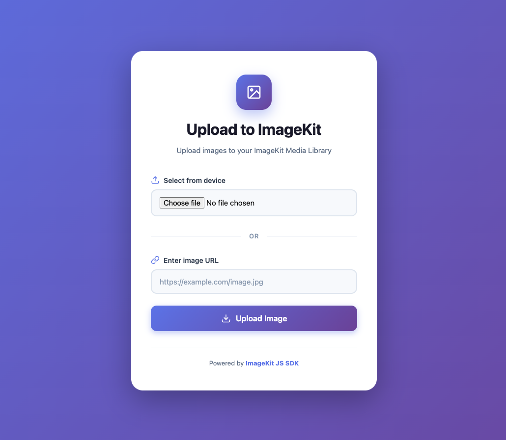

# Client-Side File Upload with ImageKit

A demo application showing how to implement secure client-side file uploads using [ImageKit](https://imagekit.io). This project demonstrates two approaches: using the **ImageKit JavaScript SDK** and the **Upload API** directly.



## Features

- Upload images from device (file picker)
- Upload images from URL (remote fetch)
- Secure client-side uploads with server-generated signatures
- Loading state with spinner animation
- Success/error feedback
- Two implementation approaches for learning

## How It Works

```
┌─────────────┐     1. Request auth     ┌─────────────┐
│             │ ──────────────────────► │             │
│   Browser   │                         │   Server    │
│  (Client)   │ ◄────────────────────── │  (Node.js)  │
│             │  2. token, signature,   │             │
└─────────────┘       expire            └─────────────┘
       │
       │ 3. Upload file with auth params
       ▼
┌─────────────┐
│  ImageKit   │
│   Servers   │
└─────────────┘
```

**Why this architecture?**
- Private keys stay on your server (never exposed to client)
- Signatures are short-lived (expire in ~30 mins)
- Each upload gets a unique token (prevents replay attacks)

## Prerequisites

- [Node.js](https://nodejs.org/) (v16 or higher)
- [ImageKit Account](https://imagekit.io/registration) (free tier available)

## Setup

### 1. Clone the repository

```bash
git clone <your-repo-url>
cd ClientSideFileUpload
```

### 2. Install dependencies

```bash
npm install
```

### 3. Configure environment variables

```bash
cp .env.sample .env
```

Edit `.env` with your ImageKit credentials (from [Dashboard > Developer Options](https://imagekit.io/dashboard/developer/api-keys)):

```env
IMAGEKIT_PUBLIC_KEY=your_public_key
IMAGEKIT_PRIVATE_KEY=your_private_key
IMAGEKIT_URL_ENDPOINT=https://ik.imagekit.io/your_imagekit_id
ALLOWED_ORIGIN=http://localhost:5500,http://127.0.0.1:5500
```

### 4. Update the public key in client files

Update the `publicKey` value in both `script.js` (line 74) and `script-sdk.js` (line 20) with your public key.

### 5. Start the server

```bash
npm start        # Production
npm run dev      # Development (auto-reload)
```

### 6. Open the frontend

Open `index.html` in your browser using a local server (e.g., VS Code Live Server on port 5500).

## Project Structure

```
ClientSideFileUpload/
├── index.html          # Frontend UI
├── style.css           # Styles
├── script-sdk.js       # Upload using ImageKit JS SDK
├── script.js           # Upload using Upload API directly
├── index.js            # Node.js server for auth endpoint
├── package.json        # Dependencies
├── .env.sample         # Environment template
├── .env                # Your credentials (git-ignored)
└── .gitignore          # Git ignore rules
```

## Two Implementation Approaches

### Option 1: ImageKit JavaScript SDK (Recommended)

Uses the official `@imagekit/javascript` SDK which handles the upload internally.

```javascript
// script-sdk.js
const uploadResponse = await ImageKit.upload({
  file: file,
  fileName: file.name,
  publicKey: "your_public_key",
  signature: authData.signature,
  token: authData.token,
  expire: authData.expire,
});
```

**Pros:** Cleaner code, SDK handles edge cases

### Option 2: Direct Upload API

Uses `fetch()` to call the ImageKit Upload API directly with `FormData`.

```javascript
// script.js
const formData = new FormData();
formData.append("file", file);
formData.append("fileName", file.name);
formData.append("publicKey", "your_public_key");
formData.append("signature", authData.signature);
// ...

const response = await fetch(
  "https://upload.imagekit.io/api/v1/files/upload",
  { method: "POST", body: formData }
);
```

**Pros:** No SDK dependency, full control over the request

### Switching Between Approaches

In `index.html`, comment/uncomment the relevant script tags:

```html
<!-- Option 1: Using ImageKit JS SDK -->
<script src="https://unpkg.com/@imagekit/javascript@5.0.0/dist/imagekit.min.js"></script>
<script src="script-sdk.js"></script>

<!-- Option 2: Using Upload API directly (uncomment below, comment above) -->
<!-- <script src="script.js"></script> -->
```

## Relevant Links

### ImageKit Documentation
- [JavaScript SDK Guide](https://imagekit.io/docs/integration/javascript)
- [Upload API Reference](https://imagekit.io/docs/api-reference/upload-file/upload-file)
- [Client-Side Upload Guide](https://imagekit.io/docs/upload/upload-widget)
- [Authentication for Uploads](https://imagekit.io/docs/api-reference/upload-file/upload-file#authentication)

### GitHub Repositories
- [ImageKit JavaScript SDK](https://github.com/imagekit-developer/imagekit-javascript)
- [ImageKit Node.js SDK](https://github.com/imagekit-developer/imagekit-nodejs)

### Other Resources
- [ImageKit Dashboard](https://imagekit.io/dashboard)
- [ImageKit Pricing](https://imagekit.io/plans) (generous free tier)

## Common Issues

### "Invalid signature" error
- Ensure your `.env` has the correct private key
- Restart the server after changing `.env`
- Check that the public key in JS files matches your account

### CORS errors
- Add your frontend URL to `ALLOWED_ORIGIN` in `.env`
- Restart the server after changes

### "Cannot connect to server"
- Make sure the Node server is running (`npm start`)
- Check that the auth endpoint URL matches in JS files

## License

ISC

---

Powered by [ImageKit JS SDK](https://imagekit.io)
